<picture>
  <source media="(max-width: 600px) and (prefers-color-scheme: dark)" srcset="assets/receipts-compact-dark.svg">
  <source media="(max-width: 600px)" srcset="assets/receipts-compact-light.svg">
  <source media="(prefers-color-scheme: dark)" srcset="assets/receipts-dark.svg">
  
</picture>

SDE-1 at **Concentrix Catalyst**, building agentic workflows in production. On my own time I build systems where an agent's mistake would be expensive, and I publish how I checked them.

### Receipts

| Project | What it is, and the proof |
|:--|:--|
| **[Argus](https://github.com/rajj28/argus)** [showcase](https://rajj28.github.io/argus-live/) | UI-testing agent: an LLM writes each test once, then it replays deterministically and heals UI changes **0 LLM calls over 10 runs · 5/5 hidden bugs caught** |
| **[RaceLab](https://github.com/rajj28/racelab)** [demo](https://rajj28.github.io/racelab/) | What an agent should do when the data it reasoned about changes before it commits **0/50 bad commits vs 45–48/50 for blind retry, over 5,000 decisions** |
| **[Continuity](https://github.com/rajj28/continuity)** | Release checks for dubbed and subtitled films; Grafana decides whether each market can ship **5 markets · 87 checks · agents fix assets, never the verdict** |
| **[VERDICT](https://github.com/rajj28/verdict)** [live](https://verdict-vercel-eight.vercel.app) | Self-hostable hackathon judging with judge-bias correction **Rank agreement τ 0.669 → 0.877 · 1,144 tests** |
| **[Video anomaly](https://github.com/rajj28/ahc-hackathon)** [page](https://ahc-video-anomaly.vercel.app) | Traffic and CCTV anomaly detection across 11 classes, with event timestamps **38× faster than real time on a 6 GB laptop GPU** |
| **[gpu-fleet-operator](https://github.com/rajj28/gpu-fleet-operator)** | Go control plane for a GPU inference fleet (Kubernetes, Temporal) **56 tests that need no cluster to run** |

### How I build

- **Measure, then claim.** Every number above comes from a run you can repeat, like [Argus's recorded results](https://github.com/rajj28/argus/tree/main/site_data).
- **Keep the failures in the write-up.** [RaceLab](https://github.com/rajj28/racelab/blob/main/docs/METHODOLOGY.md) lists the predictions it falsified, and the [anomaly detector](https://github.com/rajj28/ahc-hackathon#what-didnt-work-and-was-not-shipped) documents the model I didn't ship.
- **Agents read the verdict; they don't write it.** In [Continuity](https://github.com/rajj28/continuity), agents reach Grafana through a write-disabled MCP server.

### Also

**1st place**, DigiPay Pro (NPCI) competition, IIT Bombay Techfest 2024, out of 200+ teams ([code](https://github.com/rajj28/FraudDetectionUsingGANs)) 
**Merged fixes** in [Eclipse Theia](https://github.com/eclipse-theia/theia/pulls?q=is%3Apr+author%3Arajj28+is%3Amerged), [Eclipse Thing-Web](https://github.com/eclipse-thingweb/domus-tdd-api/pull/27) and [rust-ffmpeg-sys](https://github.com/zmwangx/rust-ffmpeg-sys/pull/121) 
**Writing:** [Teaching AI to read financial tables: fine-tuning LayoutLMv3](https://medium.com/@ruturajsonkamble29/teaching-ai-to-read-financial-tables-fine-tuning-layoutlmv3-on-10-k-filings-and-invoices-dcb0c93c448d)

Python · Go · TypeScript · PyTorch · Playwright · FastAPI · Django · PostgreSQL · CockroachDB · Docker · GCP · AWS

[ruturaj.is-a.dev](https://ruturaj.is-a.dev) · [LinkedIn](https://www.linkedin.com/in/ruturaj29) · [ruturajsonkamble29@gmail.com](mailto:ruturajsonkamble29@gmail.com)
